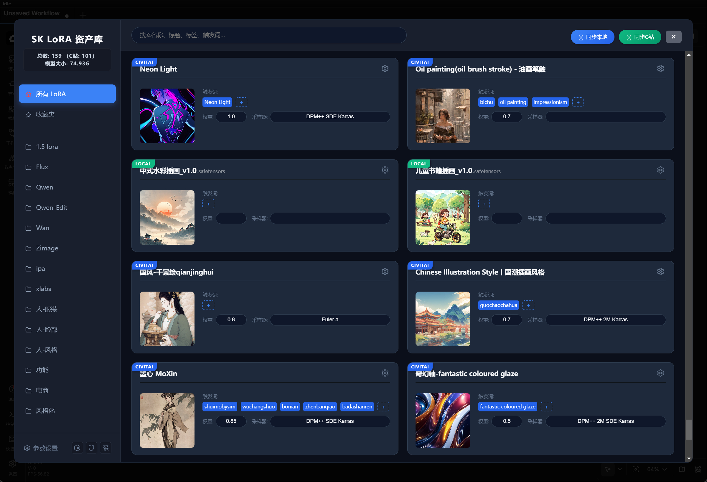
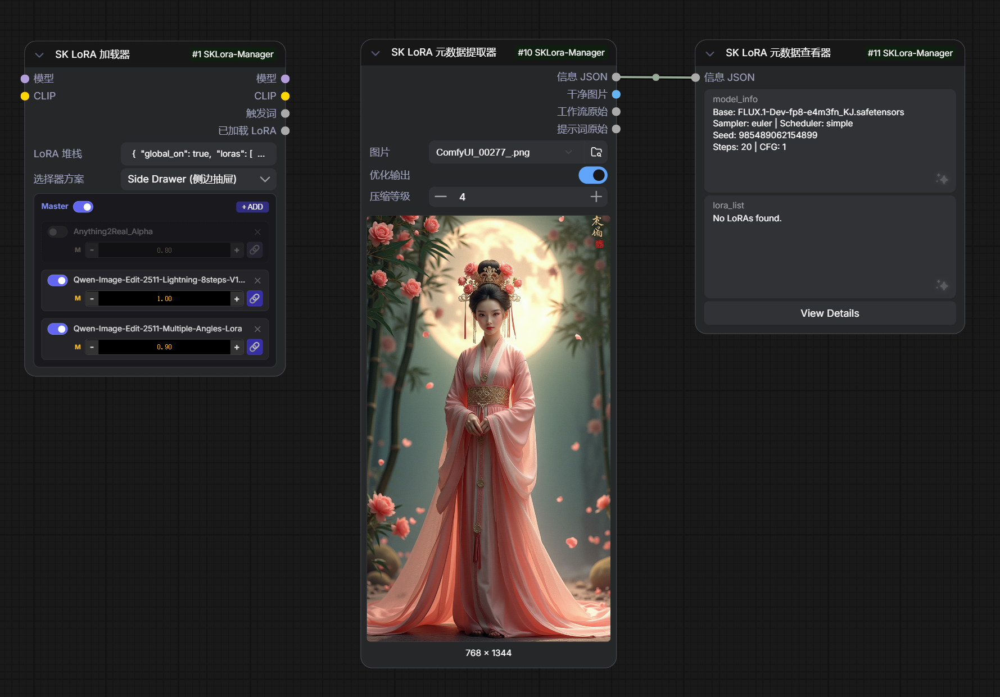

# SK LoRA Manager - ComfyUI 强大 LoRA 管理助手

[](https://github.com/sinvks/ComfyUI-SKLora-Manager)
[](LICENSE)

SK LoRA Manager 是一款专为 ComfyUI 设计的高级 LoRA 管理插件。它不仅提供美观的预览和分类管理功能，还集成了强大的 LLM（大语言模型）支持，帮助您更高效地管理、搜索和使用您的 LoRA 模型。





## 🌟 主要功能

- **🎨 深度模型管理**：提供完整的 LoRA 预览图、标签管理和分类功能，支持从 Civitai 自动抓取元数据。
- **🤖 智能 LLM 集成**：内置多种 LLM 提供商支持（OpenAI, Gemini, DeepSeek, Groq, 智谱AI, Xflow 等），可用于自动生成触发词、描述和标签。
- **🖥️ 交互式编辑器**：集成式管理面板，支持实时搜索、一键插入触发词、批量编辑等操作。
- **📊 Prompt 矩阵**：内置多种 Prompt 矩阵节点（V1/V2/V3），方便进行模型对比测试。
- **🌐 全球化支持**：完整支持简体中文、繁体中文和英文界面。
- **📥 Civitai 助手**：一键同步 Civitai 模型信息，自动下载预览图和触发词。

## 🛠️ 安装方法

### 方法 1: 使用 ComfyUI Manager
1. 打开 ComfyUI Manager
2. 点击 "Custom Nodes Manager"
3. 搜索 "SK LoRA Manager" 并安装
4. 重启 ComfyUI

### 方法 2: 手动安装
```bash
cd ComfyUI/custom_nodes
git clone https://github.com/sinvks/ComfyUI-SKLora-Manager.git
pip install -r requirements.txt
```

## 🚀 快速上手

1. **扫描模型**：初次使用时，插件会自动扫描您的 `models/loras` 目录。

2. **管理面板**：点击顶部菜单中的“SK LoRA 管理”图标即可打开主面板。

3. **参数设置**：在主面板左下角点击参数设置进入设置面板，在“基础配置”中填写Civitai API Key（这是实现同步C站的基础，可实现“同步C站”按钮的基础扫描）。

4. **同步本地**：主面板右上角的“同步本地”按钮可实现本地models\lora目录的lora文件扫描入库。

5. **同步C站**：主面板右上角的“同步C站”按钮需要在“同步本地”执行后再执行，会对本地模型与C站进行关联并获取相关信息（需设置Civitai API Key，如果想使用AI分析，请参考说明6中的操作）

6. **高级设置**：如果要体验AI赋能，请在“参数设置”面板的“高级设置”中进行“LLM 大模型配置”并开启，LLM配置管理面板中提供了多家主流供应商，选择并填写您的key后测试通过即可保存在选用列表中（如果想使用哪个可以将其设为默认），友情提示：请根据自身需要选择服务商，部分模型可能会收费，具体以服务商为准；条件允许，可选用本地Ollama。

7. **浮动菜单**：主面板Lora卡片右上角的浮动菜单中，设置了多种操作，“同步C站数据”需配置Civitai API Key；“AI分析数据”需开启并“LLM 大模型配置”，同时模型卡片中填写了模型网址；“使用此Lora”可将选定的lora注入到工作流的“SK LoRA 加载器”（位于节点->SK LoRA Manager中）

8. **底模设置**：C站获取的模型一般会自动设置底模，其他请自行添加修改，“参数设置”面板->底模管理中添加了预设底模，可自行排序调整，主面板Lora卡片上可手动添加和删除自定义底模

   > AI大模型仅为辅助并非全能，部分信息需手动填写修改；
   >
   > 建议在进行删除或修改前进行数据备份（手动备份：参数设置->高级设置；在进行同步C站操作和删除重复项操作时，插件会自动备份，备份文件位于user\default\SKLoraManager-Data目录）
   >
   > 其它功能请自由探索，如有问题请反馈

## 📦 包含节点

- `SK LoRA Manager`: 核心管理节点。
- `SK Interactive Editor`: 交互式 Prompt 编辑器。
- `SK LoRA Meta Extractor`: 模型元数据提取工具。
- `SK Prompt Matrix`: 用于生成测试矩阵的节点。

##  更新日志

### v1.0.4
- **修复模型详情链接**：更新了模型详情链接，从 .com 到 .red，以适应 Civitai 最近的域名重构。确保用户可以访问完整的模型详情，避免 404 错误。


### v1.0.3
- **修复节点卡死**：修复了 `SK Point Indexer` 和 `SK Interactive Editor` 节点在从剪贴板粘贴图片时可能导致的预览不显示及程序卡死问题。

### v1.0.2
- **🛡️ 数据防覆盖机制**：实现了全新的数据初始化与智能合并逻辑。用户在更新插件版本时，原有的 LoRA 数据库、配置文件、自定义底模等数据将被完整保留，不再会被初始模板覆盖。
- **🤖 LLM 功能优化**：增加了NVIDIA的NIM服务支持，优化了自定义LLM功能。
- **🔄 同步体验优化**：修改了开启LLM时批量同步 Civitai 元数据后入库语言的设定规则（跟随插件设定语言）。

### v1.0.1
- **📄 LLM 功能优化**：修复非Nodes2.0模式下全局样式的冲突问题。


## �📄 开源协议

本项目采用 [MIT](LICENSE) 协议开源。

## 🤝 贡献与反馈

如果您在使用过程中遇到任何问题或有功能建议，欢迎提交 [Issue](https://github.com/sinvks/ComfyUI-SKLora-Manager/issues) 或 Pull Request。

---
*由 [sinvks](https://github.com/sinvks) 倾情打造*
